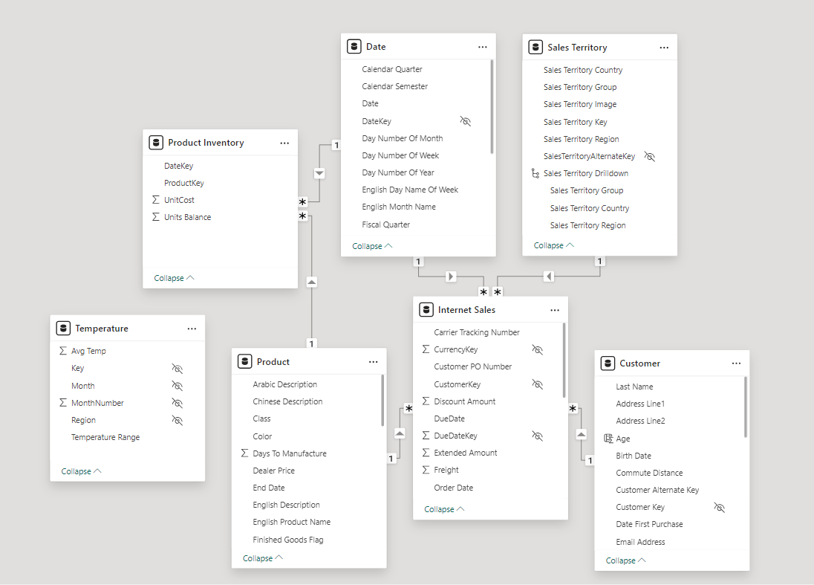

# 📚🗓️ Welcome to Power BI Dax Learning 🤓📊
- In this git repo, I embark on learning DAX language🚀💻
- Get ready to explore some fundaments 📝 of Power BI And DAX for data analysis📊🔢📈
- Happy Learning !!🤩📚💻


# Learning Resources
| Resources | Description |
| ----------- | ----------- |
|Microsoft|https://learn.microsoft.com/en-us/dax/dax-overview|
|Pragmatic Works Youtube Playlist|https://www.youtube.com/watch?v=QJw4HkagVWc&list=PLcwrIWK7WBcQmoBMuBRnRv1LaGUEdbYCT|

## Learning Logs 📑
| Index | Skill Learned |
| ----------- | ----------- |
|[**Introduction**](#introduction)|DAX Overview, Calculated table,columns and Row level security|
|[**Aggregation Functions**](#aggregate-functions-overview)|Overview on some Aggregate Functions in DAX|
|[**DAX Fundamentals**](#dax-fundamentals)|Navigation Functions,Calculated Columns, Calculated Measures|
|Date and Time Functions||
|Filter Functions||
|Relationship Functions||
|Table Manipulation Functions||
|Time Intelligence Functions||
|DAX Statements||

# Learning Guide
- Through this learning journey, I will be following the resource mention in above learning resources table.
- For the starter Power BI files, you can refer to [Pragmatic Working Files](https://github.com/Anish-shakya/Power-BI-DAX-Learning/tree/main/Assets/PragmaticWorkFiles)
- Use Fresh file inorder to follow along the resource mention above.

# Introduction
## DAX Overview
- DAX (Data Analysis Expression) is a formula expression language.
- It is used in Analytics services, Power BI , Power Pivot in Excel.
- DAX formula is used to created calculated columns, calulated tables and custom measures for our analysis

## Measures
- Measure in Power BI are calculations made using DAX formula which is used in analysis and reporting.
- Measure can often be aggregation,caculations or operations in our data.
## Calculated Columns
- Calulated Columns refers to new columns that are created using or appling dax fomula to exiting columns in our dataset.
- Values in calculated columns are static,fixed and store in our dataset.
## Calculated Tables
- Calculated tables are tables that are created within Power BI using DAX expressions.
- These tables are not part of our original data source but instead, they are dynamically generated based on DAX expressions we define.
## Row Level Security
- Row-level security (RLS) in Power BI allows us to restrict access to specific rows of data based on the user who is accessing the report or dashboard.

# Aggregate Functions Overview
- Functions that operates on a set of values and return a single value as a result.
- Some of the commonly used Aggregate functions are SUM,AVG,MIN,MAX,COUNT.
- It can be used to summarize a data and perform various types of calculations. 

|Fucntion|Description|
|--------|-----------|
|**APPROXIMATEDISTINCTCOUNT**|Returns an estimated count of unique values in a column.|
|**AVERAGE**|Returns the average (arithmetic mean) of all the numbers in a column.|
|**AVERAGEA**|Returns the average (arithmetic mean) of the values in a column.|
|**AVERAGEX**|Calculates the average (arithmetic mean) of a set of expressions evaluated over a table.|
|**COUNT**|Counts the number of rows in the specified column that contain non-blank values.|
|**COUNTA**|Counts the number of rows in the specified column that contain non-blank values.|
|**COUNTX**|Counts non-blank results when evaluating the result of an expression over a table|
|**COUNTBLANK**|Counts the number of blank cells in a column.|
|**COUNTROWS**|Counts the number of rows in the specified table, or in a table defined by an expression.|
|**COUNTX**|Counts the number of rows that contain a number or an expression that evaluates to a number, when evaluating an expression over a table.|
|**DISTICTCOUNT**|Counts the number of distinct values in a column.|
|**DISTINCTCOUINTNOBLANK**|Counts the number of distinct values in a column.|
|**MAX**|Returns the largest numeric value in a column, or between two scalar expressions.|
|**MAXA**|Returns the largest value in a column.|
|**MAXX**|Evaluates an expression for each row of a table and returns the largest numeric value.|
|**MIN**|Returns the smallest numeric value in a column, or between two scalar expressions.|
|**MINA**|Returns the smallest value in a column, including any logical values and numbers represented as text.|
|**MINX**|Returns the smallest numeric value that results from evaluating an expression for each row of a table.|
|**PRODUCT**|Returns the product of the numbers in a column.|
|**PRODUCTX**|Returns the product of an expression evaluated for each row in a table.|
|**SUM**|Adds all the numbers in a column.|
|**SUMX**|Returns the sum of an expression evaluated for each row in a table.|


# DAX Fundamentals

- This is the glimpse of data model I'll be using Through out this learning journey.
## Navigation Functions
### RELATED
- Returns a value from a connected table
### RELATEDTABLE
 - Returns a table from a connected table

## Caculated Column
#### Creating Full Name using First and Last Name Column
```
//Creating fullname using First Name and Last Name Column in Customer Table
Full Name = 'Customer'[First Name] & " " & 'Customer'[Last Name]'
```
- When we create a calculated columns, it creates something we called a row context which apply the dax to each row present in that particular table.

#### Creating Age Break Down using conditional Logic in DAX
```
Age Breakdown = 
IF('Customer'[Age]>=55,"55+",
IF(Customer[Age] >= 45,"45-54",
IF(Customer[Age] >=35, "35-44",
IF(Customer[Age] >=18,"18-34",
"below 18"
))))

```

#### Creating two digit month and four digit year
```
Month Year = 
// MM - YEAR
FORMAT(
    'Date'[Date],
    "MM-YYYY")
```
#### Creating Temperature Key Column to create Relationship between internet sales table and temperature table
```
Temperature Key = 
RELATED('Sales Territory'[Sales Territory Region]) & RELATED('Date'[Month Number Of Year])
```
#### Creating Transaction Count and Region Volume with respect to the Territory
```
Total Transactions = 
 COUNTROWS(
RELATEDTABLE('Internet Sales') //RELATEDTABLE is used to filter the rows based on the Relationship key column
 )

Region Volume = 
SWITCH(TRUE(),
'Sales Territory'[Total Transactions] >= 7000, "High Volume",
'Sales Territory'[Total Transactions] >= 4000, "Medium Volume",
'Sales Territory'[Total Transactions] >=1,"Low volume",
"NA"
)
```

#### Finding Customer last purchase Date
```
Last Purchase Date = 
MAXX(RELATEDTABLE('Internet Sales'),
'Internet Sales'[Order Date])
```
This DAX formula creates a calculated column to store the last purchase date of each customer. This information can be used to categorize customers into active, passive, or inactive groups.

**Breakdown of the formula**
1. **RELATEDTABLE**
    - RELATEDTABLE is used to bring the data from the internet sales table related to the current customer in dimension table Customer.
    - This function works by activating the exiting Relationship between these tables.
    - Furthermore, RELATEDTABLE also filters the rows of 'Internet Sales' to include only the rows corresponding to the current customer in the context or dimension table.

2. **MAXX Function**
    - The MAXX functions take the table as parameter which iterates over that table(In this case, filtered 'internet sales' table for particular customer) and further evalutes the expression for each row, returning the maximum value.
    - Unlike MAX function, which works on a single column and returns the maximum value without considering the row context. 

## Calculated Measures
Caculated measures are customer calculations that use formulas or expression
to derive new data form existing data.


# Semi-Additive Measure
Semi-additive measures are data that can be aggregate across some dimension,
but not all. They are used in many business senarios, such as budgeting, account balance,
and inventory balance.
```
### few basic measures
Total Cost = SUM('Internet Sales'[Total Product Cost])
Total Sales = SUM('Internet Sales'[Sales Amount])
Total Transaction = COUNTROWS('Internet Sales')
Total Profit = [Total Sales] - [Total Cost]
```
# Time Intelligence In DAX

## Year-to-Date
## Prior Year
## Year Over Year

